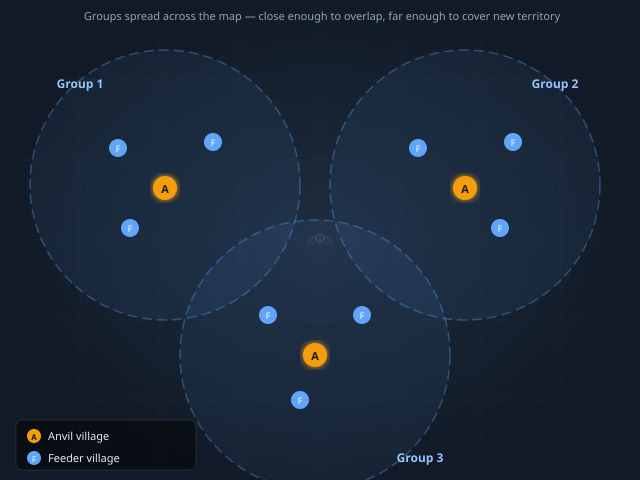

# Second Village — Anvil

## What is an Anvil?

An **anvil** is a village dedicated entirely to **defensive troops and grain production**. It doesn't produce resources for itself — it produces defensive units and feeds them. When an ally is under attack, you send your anvil's troops to defend. Between calls, your troops sit home and your grain fields feed them.

The anvil is one of the most important roles in a team. A well-fed anvil with thousands of troops can be the difference between winning and losing a server.

---

## Village Groups — How We Expand

We build villages in **groups of 4**:
- **3× Feeder village** — produce resources, generate CP, ship surplus to the anvil
- **1× Anvil village** — produce grain, train defensive troops non-stop

Once your first group of 4 is running, repeat the pattern. Each new anvil gets 3 new feeders to support it.

**Spreading across the map matters.** Villages within a group should be as close together as possible (fast trade routes). But each new group should be settled in a different part of the map — far enough to cover new territory and farm different inactive players, but not so far that coordination becomes difficult.

> The circles represent each group's farming and trade radius. They overlap slightly — groups are connected but each covers its own area of the map.

---

## Choosing the Right Tile

> **Forget 15c.** If you need this guide, you're not yet in a position to compete for a 15c. Find a **3-3-3-9** tile instead — 9 croplands, 3 of everything else.

**What to look for:**
- As close to your first village as possible (fast merchant routes)
- At least **2 oases with grain bonus** — a 25%+25% or 25%+50% grain oasis pair compounds massively over the server

> 💡 Resource fields in this village will **never exceed level 10** — there is no Palace here. That's fine. The 9 croplands at L10 with grain oases and Bakery will produce more than enough.

---

## Build Strategy

### Phase 1 — Grain first

The anvil lives or dies by its grain output. Before training a single troop, get your food base online.

| Step | What |
|------|------|
| 1 | Main Building → 5 |
| 2 | All 9 Croplands → 5 |
| 3 | Granary × 3 → enough to hold (upgrade as needed) |
| 4 | Warehouse × 2 → enough to hold |
| 5 | Main Building → 10 |
| 6 | All 9 Croplands → 8 |
| 7 | Bakery → 5 (grain production bonus) |
| 8 | All 9 Croplands → 10 (maximum — no Palace) |
| 9 | Main Building → 20 |
| 10 | Granary × 3 → 20, Warehouse × 2 → 20 |

> Use resources sent from your feeder villages. Don't wait for this village to be self-sufficient — it won't be until the fields are high.

### Phase 2 — Military buildings

Once grain is flowing, build military infrastructure. From this point on, **Barracks and Stable must run non-stop** if your unit type includes both infantry and cavalry (see [Choosing Defensive Units](choosing-def-units.md)).

| Step | What |
|------|------|
| 1 | Barracks → 20 |
| 2 | Stable → 20 |
| 3 | Smithy → high enough to research your units |
| 4 | Hospital → 15 (recover wounded troops instead of losing them) |
| 5 | Tournament Square → 15 (speed boost for your troops when responding to calls) |
| 6 | Workshop → 10 |

### Phase 3 — Support & CP

| Step | What |
|------|------|
| 1 | Rally Point → 10 |
| 2 | City Wall → 20 (defence bonus) |
| 3 | Marketplace → 20 |
| 4 | Trade Office → 10 |
| 5 | Town Hall → 10 |
| 6 | Residence → 10 |
| 7 | Resource buildings (non-grain) → 5 as space allows |

---

## Final Build — Anvil (22/22 slots)

| # | Building | Level |
|---|----------|-------|
| 1 | Main Building | 20 |
| 1 | Rally Point | 10 |
| 2 | Warehouse | 20 |
| 3 | Granary | 20 |
| 1 | Marketplace | 20 |
| 1 | Trade Office | 10 |
| 1 | Barracks | 20 |
| 1 | Stable | 20 |
| 1 | Workshop | 10 |
| 1 | Hospital | 15 |
| 1 | Tournament Square | 15 |
| 1 | Residence | 10 |
| 1 | Town Hall | 10 |
| 1 | Res buildings (Mill L5 + Bakery L4) | 5 |
| 1 | City Wall | 20 |

---

## Running the Anvil

- **Train troops non-stop.** Every idle minute in the queue is lost DEF capacity.
- **Feeders ship resources daily.** Set up trade routes from all 3 feeders to the anvil.
- **Hospital saves losses.** Wounded troops return — always keep the Hospital running.
- **Tournament Square.** Higher level = faster troop response when a call comes in. Prioritise it.
- **Don't build Great Barracks or Great Stables.** For the same cost, run 3 normal Barracks across 3 villages and triple your output.

> Which units to train? → [Choosing Defensive Units](choosing-def-units.md)
